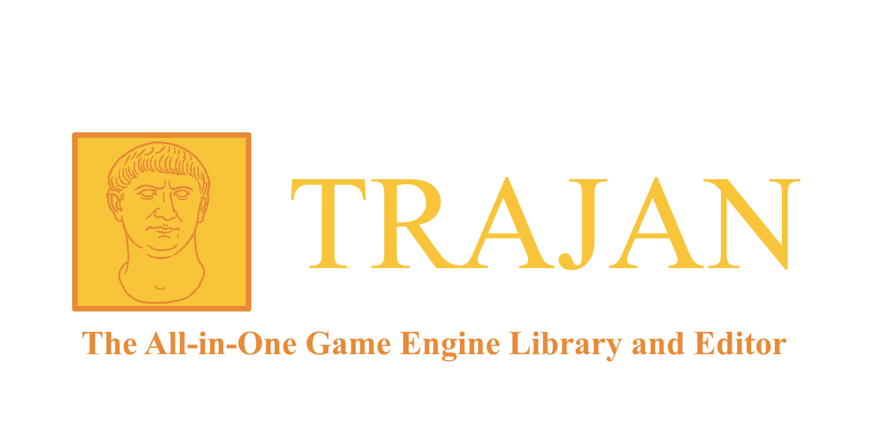

<!-- Badges: add/remove as needed -->
<!-- Example:  -->
<p align="center">
  
</p>

<h1 align="center">Trajan</h1>
<p align="center">
  The All-in-One Game Engine Library and Editor
</p>
<!--
<p align="center">
  <a href="#-features">Features</a> •
  <a href="#-quick-start">Quick Start</a> •
  <a href="#-docs">Docs</a> •
  <a href="#-roadmap">Roadmap</a> •
  <a href="#-contributing">Contributing</a>
</p>
-->

---

## ✨ Highlights (TL;DR)
<!-- Keep this scannable. 5–8 bullets max. -->
- Modular C++ game engine with **ECS** framework.
- Interfaced renderer with modern **OpenGL** and **Vulkan** support (with more to come).
- Exports as a **dynamic library** for easy use in any application.
- *Optional* editor, using **imgui**.
- Supported Platforms: Windows
<!-- - Scripting via **Lua / C#** eventually --> 
- Asset pipeline with hot-reload & UUIDs.
<!-- - Binary & JSON serialization (if true). -->
- MIT license.

---

## 📚 Table of Contents
- [About](#-about)
- [Requirements](#-requirements)
- [FAQ](#-faq)
- [License](#-license)
- [Credits & Acknowledgments](#-credits--acknowledgments)

---

## 🧠 About
**Trajan** is a game engine library that is modular and easy to start.  
**Why another engine?** The main goal of Trajan is to support developers with an optional editor and an clear and easy to use library, for those that don't want an editor, or want to use their own! Trajan also supports api-agnostic rendering. In short, **Trajan's goal is to let you do whatever you want**.

**Status:** alpha. Currently many features, including all of the editor, are missing/unstable.

**Production use:** no (although, everything existing is production/memory safe, etc.)

---

<!--
## 🖼 Screenshots & Demos
| Editor | In-game | Tools |
|---|---|---|
|  |  |  |

**Try it now:** (enter link here?)
-->
<!--
---

## 🏗 Architecture
High-level map of major subsystems; link to per-topic docs.

- **Core:** platform, memory, logging, job system.
- **ECS:** entities, components, systems; update order.
- **Renderer:** backend-agnostic interface; backends (OpenGL/Vulkan/…); render graph / forward+ / deferred.
- **Assets:** importers, hot-reload, GUIDs, virtual FS.
- **Scripting:** Lua/C# bindings, API surface.
- **Physics/Audio/Networking:** libraries used & integration points.
- **Editor:** panels, property inspectors, gizmos.
- **Serialization/Save:** binary/JSON, versioning.
- **Testing/CI:** unit/integration tests, platforms covered.

> Optional: add a diagram: `docs/architecture/overview.svg`.

---

## ✅ Features

- [ ] Cross-platform (Windows / macOS / Linux)
- [ ] Rendering: Forward / Deferred / PBR / Shadows / PostFX
- [ ] Materials: UBOs/SSBOs, shader reflection, hot-reload
- [ ] ECS: archetype/packed storage, filters, events
- [ ] Scene: hierarchy, prefabs, serialization
- [ ] Input: keyboard/mouse/gamepad, remapping
- [ ] UI: ImGui editor + in-game UI (if any)
- [ ] Scripting: Lua / C# (delete if N/A)
- [ ] Physics: 2D/3D engine (Box2D/Bullet/PhysX?) (if any)
- [ ] Audio: FMOD/OpenAL/etc. (if any)
- [ ] Asset pipeline: importers (FBX/GLTF/PNG/…)
- [ ] Build system: CMake presets, vcpkg/conan (if used)

---
-->
## 🔧 Requirements
- **Language:** C++20
- **Build:** CMake ≥ 3.xx, Ninja/MSBuild/Xcode
- **Compilers:** MSVC 19.xx, Clang 16+, GCC 12+
- **SDKs:** Vulkan SDK 1.4.x (optional), OpenGL 4.6 (optional - but default), latest GPU drivers
- **Dependencies:** GLFW, glm, ImGui, stb, etc. (provided as submodules)
- **OS Support:** Windows 10/11, <!-- Ubuntu 22.04 -->
<!--
---

## ⚡ Quick Start
> For people who just want to build and run a sample ASAP.

```bash
# 1) Get the code (with submodules if you use them)
git clone https://github.com/ORG_OR_AUTHOR/ENGINE_NAME.git
cd ENGINE_NAME
git submodule update --init --recursive  # if applicable

# 2) Configure & build (generic)
cmake -S . -B build -DCMAKE_BUILD_TYPE=Release
cmake --build build -j

# 3) Run the sample app
./build/bin/SampleApp           # Linux/macOS
build\bin\SampleApp.exe       # Windows
```

<details>
<summary>Windows (MSVC)</summary>

```powershell
cmake -S . -B build -G "Visual Studio 17 2022" -A x64
cmake --build build --config Release -j
.uildin\Release\SampleApp.exe
```
</details>

<details>
<summary>Windows (MinGW + Ninja)</summary>

```bash
cmake -S . -B build -G Ninja -DCMAKE_BUILD_TYPE=Release
cmake --build build -j
build/bin/SampleApp.exe
```
</details>

<details>
<summary>macOS</summary>

```bash
brew install cmake ninja # plus deps if needed
cmake -S . -B build -G Ninja -DCMAKE_BUILD_TYPE=Release
cmake --build build -j
./build/bin/SampleApp
```
</details>

<details>
<summary>Linux (Ubuntu)</summary>

```bash
sudo apt update && sudo apt install -y build-essential cmake ninja-build   libx11-dev libxrandr-dev libxi-dev libgl1-mesa-dev # adjust for your deps
cmake -S . -B build -G Ninja -DCMAKE_BUILD_TYPE=Release
cmake --build build -j
./build/bin/SampleApp
```
</details>

---

## 🛠 Build & Install
**CMake Options (edit as needed):**

| Option | Default | Description |
|---|---:|---|
| `ENGINE_BUILD_EDITOR` | `ON` | Build the editor UI |
| `ENGINE_BUILD_SAMPLES` | `ON` | Build sample projects |
| `ENGINE_BACKEND_OPENGL` | `ON` | Enable OpenGL backend |
| `ENGINE_BACKEND_VULKAN` | `OFF` | Enable Vulkan backend |
| `ENGINE_ENABLE_LUA` | `OFF` | Lua scripting support |
| `ENGINE_ENABLE_CSHARP` | `OFF` | C# scripting support |
| `ENGINE_ENABLE_TESTS` | `ON` | Unit/integration tests |

```bash
cmake -S . -B build -DENGINE_BACKEND_VULKAN=ON -DENGINE_BUILD_EDITOR=OFF
cmake --build build -j
```

**Install (optional):**
```bash
cmake --install build --prefix /usr/local
```

---

## ⚙️ Configuration
- **Config files:** `config/engine.toml` (or JSON/YAML) for renderer, window, input.
- **Environment variables:** `ENGINE_ASSET_DIR`, `ENGINE_LOG_LEVEL`.
- **Runtime flags:** `--renderer=vulkan --width=1920 --height=1080 --vsync=1`.
- **Logging:** levels, file location, how to enable debug overlays.

---

## 🧪 Samples
Briefly describe each sample and what it demonstrates.

| Sample | Description | How to run |
|---|---|---|
| `01-triangle` | Minimal renderer bring-up | `bin/Triangle` |
| `02-ecs-basics` | Entities, components, systems | `bin/EcsBasics` |
| `03-deferred` | G-Buffer + lighting | `bin/Deferred` |

---

## 📖 Docs
- **Getting Started:** docs/getting-started.md
- **User Guide (Editor):** docs/editor.md
- **Scripting API:** docs/scripting.md
- **Rendering:** docs/rendering.md
- **ECS:** docs/ecs.md
- **Asset Pipeline:** docs/assets.md
- **Serialization:** docs/serialization.md
- **Contributing Guide:** CONTRIBUTING.md
- **Code of Conduct:** CODE_OF_CONDUCT.md
- **Changelog:** CHANGELOG.md

> Consider publishing docs as a GitHub Pages site (`/docs`).

---

## 🗺 Roadmap
- [ ] Milestone 1: Rendering core (forward), input, basic ECS
- [ ] Milestone 2: Editor panels, asset hot-reload
- [ ] Milestone 3: Deferred/PBR, materials system
- [ ] Milestone 4: Scripting, prefab workflow
- [ ] Milestone 5: Physics & audio integrations

See [open issues](../../issues) and [Project board](../../projects) for details.

---

## 🤝 Contributing
We welcome PRs! Please:
1. Read **CONTRIBUTING.md** (coding style, DCO/CLA if used).
2. Open an issue for large changes before starting work.
3. Write tests where possible; run `ctest` locally.

**Good first issues:** [label:good first issue](../../issues?q=is%3Aissue+is%3Aopen+label%3A%22good+first+issue%22)

---

## 🗣 Community & Support
- **Discussions:** [GitHub Discussions](../../discussions)
- **Chat:** Discord/Matrix/Slack invite
- **Bugs:** Open an issue with repro steps and logs
- **Security:** see [Security](#-security)

---
-->
## ❓ FAQ
**Q:** Does Trajan support OpenGL/Vulkan/Metal/etc.?  
**A:** Trajan is api-agnostic in it's renderer. Currently, OpenGL 4.6 and Vulkan 1.4 have implemented renderers. More support for other renderers are planned. You can also implement your own.

**Q:** Is hot-reload supported?  
**A:** Not currently. This is a planned feature.

**Q:** Can I make commercial games with it?  
**A:** Let me figure out lisence stuff first. Need to make sure you credit libraries used by Trajan. Credit Trajan itself if you want.

---
<!--
## 🧩 Troubleshooting
- **Nothing renders / blank window**
  - Verify GPU drivers and backend selection (`--renderer=opengl`).
  - Check logs at `logs/engine.log`.
- **Vulkan validation errors**
  - Install correct Vulkan SDK; enable validation layers.
- **Build fails on Windows**
  - Use matching generator (`-G "Visual Studio 17 2022"`), run in Developer Prompt.

Add platform-specific gotchas you see often.

---
-->
## 📄 License
Copyright (c) 2025 Collin Longoria

Permission is hereby granted, free of charge, to any person obtaining a copy
of this software and associated documentation files (the "Software"), to deal
in the Software without restriction, including without limitation the rights
to use, copy, modify, merge, publish, distribute, sublicense, and/or sell
copies of the Software, and to permit persons to whom the Software is
furnished to do so, subject to the following conditions:

The above copyright notice and this permission notice shall be included in all
copies or substantial portions of the Software.

THE SOFTWARE IS PROVIDED "AS IS", WITHOUT WARRANTY OF ANY KIND, EXPRESS OR
IMPLIED, INCLUDING BUT NOT LIMITED TO THE WARRANTIES OF MERCHANTABILITY,
FITNESS FOR A PARTICULAR PURPOSE AND NONINFRINGEMENT. IN NO EVENT SHALL THE
AUTHORS OR COPYRIGHT HOLDERS BE LIABLE FOR ANY CLAIM, DAMAGES OR OTHER
LIABILITY, WHETHER IN AN ACTION OF CONTRACT, TORT OR OTHERWISE, ARISING FROM,
OUT OF OR IN CONNECTION WITH THE SOFTWARE OR THE USE OR OTHER DEALINGS IN THE
SOFTWARE.

---

## 🙏 Credits & Acknowledgments
- Third-party libs: (see submodules)
<!-- - Inspiration: -->
- Contributors: Collin Longoria
